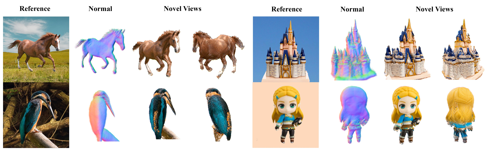
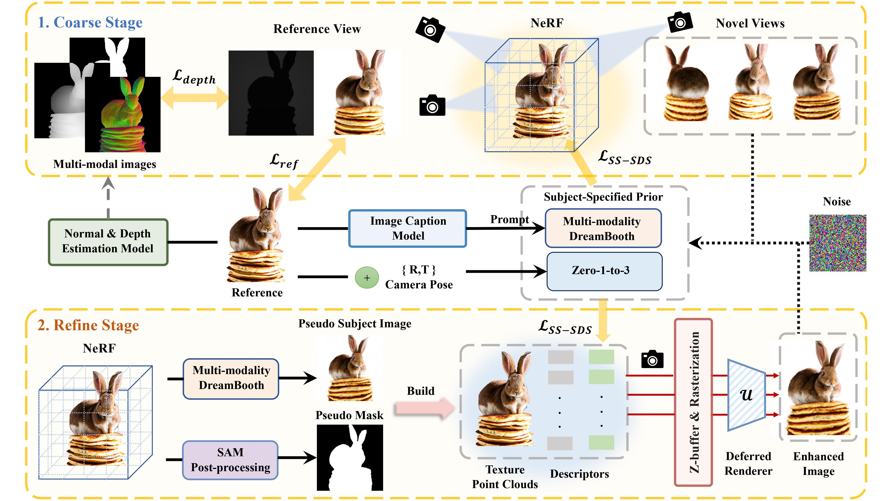

# Customize-It-3D: High-Quality 3D Creation from A Single Image Using Subject-Specific Knowledge Prior
<h5 align="center"> If you like our project, please give us a star ⭐ on GitHub for latest update.  </h2>

<!--  -->
<p align="center">
  
</p>

[Nan Huang](https://github.com/nnanhuang),
[Ting Zhang](https://www.microsoft.com/en-us/research/people/tinzhan/),
[Yuhui Yuan](https://www.microsoft.com/en-us/research/people/yuyua/),
[Dong Chen](https://www.microsoft.com/en-us/research/people/doch/),
[Shanghang Zhang](https://www.shanghangzhang.com/)

[](http://arxiv.org/abs/2312.11535)
[](https://nnanhuang.github.io/projects/customize-it-3d/)

<p align="center">
  
</p>

<div align="center">
<b>Pipeline.</b> We propose a two-stage framework Customize-It-3D for high-quality 3D creation from a reference image with subject-specific diffusion prior. We first cultivate subject-specific knowledge prior using multi-modal information to effectively constrain the coherency of 3D object with respect to a particular identity. At the coarse stage, we optimize a NeRF for reconstructing the geometry of the reference image in a shading-aware manner. We further build point clouds with enhanced texture from the coarse stage, and jointly optimize the texture of invisible points and a learnable deferred renderer to generate realistic and view-consistent textures.
</div>

## Demo of 360° geometry


## News
- [2323/12/22] Code is available at GitHub!
- [2323/12/20] Paper is available at ArXiv!
- [2023/12/14] Our code and paper will open soon. 

## Install
We only test on Ubuntu 22 with torch 2.0.1 & CUDA 11.7 on an A100. Make sure git, wget, Eigen are installed.  
```
conda install pytorch==2.0.1 torchvision==0.15.2 torchaudio==2.0.2 pytorch-cuda=11.7 -c pytorch -c nvidia
apt update && apt upgrade
apt install git wget libeigen3-dev -y
```
### Install Environment 
Install with pip:
```
    pip install git+https://github.com/NVlabs/tiny-cuda-nn/#subdirectory=bindings/torch
    pip install git+https://github.com/facebookresearch/pytorch3d.git
    pip install git+https://github.com/S-aiueo32/contextual_loss_pytorch.git@4585061   
    pip install ./raymarching
    pip install git+https://github.com/facebookresearch/segment-anything.git
```
Other dependencies:
```
    pip install -r requirements.txt 
```
### Download pre-trained models

* [Zero-1-to-3](https://github.com/cvlab-columbia/zero123) for 3D diffusion prior.
    We use `zero123-xl.ckpt` by default, reimplementation borrowed from Stable Diffusion repo, and is available in `nerf/zero123.py`.
    ```bash
    cd pretrained/zero123
    wget https://zero123.cs.columbia.edu/assets/zero123-xl.ckpt
    cd ../../
    ```

* [MiDaS](https://github.com/isl-org/MiDaS) for depth estimation.
    We use `dpt_beit_large_512.pt`. Put it in folder `pretrained/midas/`
    ```bash
    mkdir -p pretrained/midas
    cd pretrained/midas
    wget https://github.com/isl-org/MiDaS/releases/download/v3_1/dpt_beit_large_512.pt
    cd ../../
    ```

* [Omnidata](https://github.com/EPFL-VILAB/omnidata/tree/main/omnidata_tools/torch) for normal estimation.
    ```bash
    mkdir pretrained/omnidata
    cd pretrained/omnidata
    # assume gdown is installed
    gdown '1wNxVO4vVbDEMEpnAi_jwQObf2MFodcBR&confirm=t' 
    cd ../../
    ```

* [SAM](https://github.com/facebookresearch/segment-anything) to segement foreground mask of an object.
    ```bash
    cd mask
    wget https://dl.fbaipublicfiles.com/segment_anything/sam_vit_h_4b8939.pth
    cd ..
    ```

## Usage
### Preprocess
In the `./data` directory, we have included some preprocessed files that already extracted multi-modal images. If you want to test your own example, follow the following preprocessing steps and follow the file structure in `./data`. Takes seconds.

#### Step1: Extract multi-modal images [Optional]
You can preprocess single image.
```
python preprocess_image.py --path /path/to/image 
```
You can also preprocess images in list or directory.
```
bash scripts/preprocess_list.sh $GPU_IDX
bash scripts/preprocess_folder.sh $GPU_IDX /path/to/dir
```

#### Step 2: Fine-tune multi-modal DreamBooth 
Customize-It-3D uses the default [DreamBooth](https://huggingface.co/docs/diffusers/training/dreambooth) from diffuers.  To finetune multi-modal DreamBooth: 

```
bash dreambooth/dreambooth.sh $GPU_IDX $INSTANCE_DIR $OUTPUT_DIR $CLASS_NAME $CLASS_DIR
```
$INSTANCE_DIR is the path to directory containing your own image. 

$OUTPUT_DIR is the path where to save the trained model. 

$CLASS_NAME is the text prompt describing the class of the generated sample images. 

$CLASS_DIR is the path to a folder containing the generated class sample images.

For example:
```bash
bash dreambooth/dreambooth.sh 0 data/horse out/horse horse images_gen/horse
```
Don't forget the path of your trained model (in `./out` directory).


### Run 
#### Run Customize-It-3D for a single example
We use progressive training strategy to generate a full 360° 3D geometry. 
```bash
bash scripts/run.sh $GPU_IDX $WORK_SPACE $REF_PATH  $Enable_First_Stage $Enable_Second_Stage $TRAINED_MODEL_PATH $CLASS_NAME {More_Arugments}
```

As an example, run Customize-It-3D in the horse example whose trained multi-modal DreamBooth model is `out/horse` using both stages in GPU 0 and set the workspace and class name as `horse`, by the following command:
```bash
bash scripts/run.sh 0 horse data/horse/rgba/rgba.png 1 1 out/horse horse
```
#### Run Customize-It-3D for a group of examples
- Run all examples in a folder, check the scripts `scripts/run_folder.sh`  
- Run all examples in a given list, check the scripts `scripts/run_list.sh`

## Bibtex
If you find this work useful, a citation will be appreciated via:

<pre><code>
    @misc{huang2023customizeit3d,
      title={Customize-It-3D: High-Quality 3D Creation from A Single Image Using Subject-Specific Knowledge Prior}, 
      author={Nan Huang and Ting Zhang and Yuhui Yuan and Dong Chen and Shanghang Zhang},
      year={2023},
      eprint={2312.11535},
      archivePrefix={arXiv},
      primaryClass={cs.CV}
    }
</code></pre>

## Acknowledgments
This code borrows heavily from [Stable-Dreamfusion](https://github.com/ashawkey/stable-dreamfusion), many thanks to the author. 
